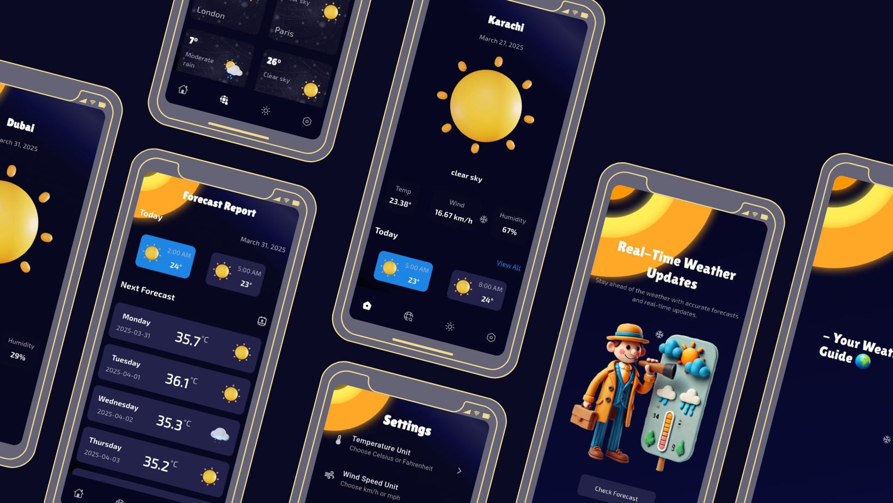

# 🌦️ Weather App

A **Flutter**-based weather application using the **OpenWeather API** 🌍.  
This app provides real-time weather updates, forecasts, and stunning weather animations.

---
## App Ui Mockup



## 📸 App Demo


---

## ✨ Features
✅ **Live Weather Data** – Fetches real-time weather updates using OpenWeather API.  
✅ **Location-based Weather** – Uses Geolocator to get weather data for the current location.  
✅ **Animated UI** – Beautiful Lottie animations based on weather conditions.  
✅ **Modern UI** – Built using Flutter Bloc & Material Design principles.  
✅ **Multi-City Weather Search** – Search for weather in any city worldwide.  
✅ **Dark & Light Mode Support** – Theming support for a better user experience.

---

## 🏗️ Project Structure

```
lib/
 ├── config/
 │   ├── bottom_nav/
 │   ├── routes/
 │
 ├── core/
 │   ├── constants/
 │   ├── exceptions/
 │   ├── extensions/
 │   ├── utils/
 │
 ├── data/
 │   ├── models/
 │   ├── network/
 │   ├── repositories/
 │   ├── response/
 │   ├── services/
 │
 ├── di/
 │   ├── service_locator.dart
 │
 ├── presentation/
 │   ├── bloc/
 │   ├── common/
 │   ├── screen/
 │   ├── views/
 │
 ├── app.dart
 ├── main.dart
```

---

## 🚀 Installation Guide

### **Step 1: Clone the Repository**
```sh
git clone https://github.com/your-username/weather-app.git
cd weather-app
```

### **Step 2: Install Dependencies**
```sh
flutter pub get
```

### **Step 3: Run the App**
```sh
flutter run
```

### **Step 4: Build Web Version**
```sh
flutter build web
```

---

## 🔗 API Configuration
1. Get your API key from [OpenWeather](https://openweathermap.org/api).
2. Add the following configuration in your project:

```dart
class ApiConstants {
  static const baseUrl = 'https://api.openweathermap.org/data/2.5';
  static const weeklyWeatherUrl =
      'https://api.open-meteo.com/v1/forecast?current=&daily=weather_code,temperature_2m_max,temperature_2m_min&timezone=auto';
  static const String apiKey = '09f5eaf0b6f7b30bc5a4c69be2950d52';
}
```

3. Ensure the API key is loaded correctly in `services/weather_service.dart`.

---

## 📦 Dependencies Used

```yaml
dependencies:
  cupertino_icons: ^1.0.8
  flutter_bloc: ^9.1.0
  http: ^1.3.0
  bloc: ^9.0.0
  dio: ^5.8.0+1
  lottie: ^3.3.1
  geolocator: ^13.0.3
  iconsax: ^0.0.8
  another_flushbar: ^1.12.30
  fluttertoast: ^8.2.10
  equatable: ^2.0.7
  get_it: ^8.0.3
  permission_handler: ^11.4.0
  jiffy: ^6.3.2
  animated_text_kit: ^4.2.3
  weather_animation: ^1.1.2
  device_preview: ^1.2.0
  shimmer: ^3.0.0
```

---

## 💡 Contributing
Pull requests are welcome. For major changes, please open an issue first to discuss what you would like to change.

---

## 📜 License
This project is licensed under the MIT License.
